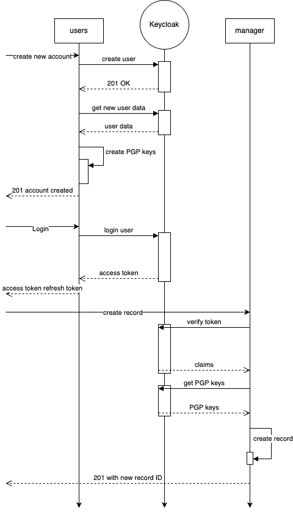

# PASSWORD MANAGER

## Simple web service which provide functionality to store and recover encrypted passwords with strong focus on security and extendability
### all passwords in the system are encrypted with individual PGP keys created during registration step

List of available functions:

1. Create new user account
2. Login to account with credentials provided on registration
3. Verify session
4. Create/List/Get/Update/Delete password records for resources using JWT session token
5. Logout from active session

* Note: `Keycloak` is used as user source with a lot of possibilities for future improvement, like multi-factor authentication, IAM etc and others. 
## Service made for PoC purposes only and need a lot of improvements
### Future improvements ###
* Add more tests
* Add features like upload PDF files..
* Expand users service to use more possibilities provided by Keycloak including verbose Registration/Authorization flows
* Use Vault to store secrets
* Improve errors handling

## Setup

The easiest way to get the application up and running is run it in the docker.
You can spin both services(users and manager) services up using the following command:

Note: for the testing purposes data for Keycloak is already in the dump so you don't need to spin up new REALM and 
service client, but if you want to - pls do. 
`docker-compose up -d --build`

### Basic usage diagram ###


## Basic usage

Please use this commands to perform basic communication with system:

* To create a new user run: 
```shell
curl --location 'http://localhost:8081/service/v1/users' \
  --header 'Content-Type: application/json' \
  --data-raw '{
  "username":"i.ivanov",
  "email":"i.ivanov@gmail.com",
  "first_name": "Ivan",
  "last_name": "Ivanov",
  "password": "Qwerty!23"
  }'
```

* To create a new user session run using credentials from previous step: 
```shell
curl --location 'http://localhost:8081/service/v1/users/login' \
  --header 'Content-Type: application/json' \
  --data '{
  "username": "i.ivanov",
  "password": "Qwerty!23"
  }'
```
* To create a new record in the system use `access_token` obtained from previous step:
```shell
curl --location 'http://localhost:8082/service/v1/records' \
  --header 'Content-Type: application/json' \
  --header 'Authorization: Bearer ••••••' \
  --data '{
  "name": "gmail.com", "value": "ololo123"
  }'
``` 

* To list all records created for current user run: 
```shell
curl --location --request GET 'http://localhost:8082/service/v1/records' \
  --header 'Content-Type: application/json' \
  --header 'Authorization: Bearer ••••••'
``` 

* To get specific record information decrypted run: 
```shell
curl --location --request GET 'http://localhost:8082/service/v1/records/{RECORD_ID}' \
  --header 'Content-Type: application/json' \
  --header 'Authorization: Bearer ••••••'
```

### Tests ###
Testing cover is very poor due to the time limits
